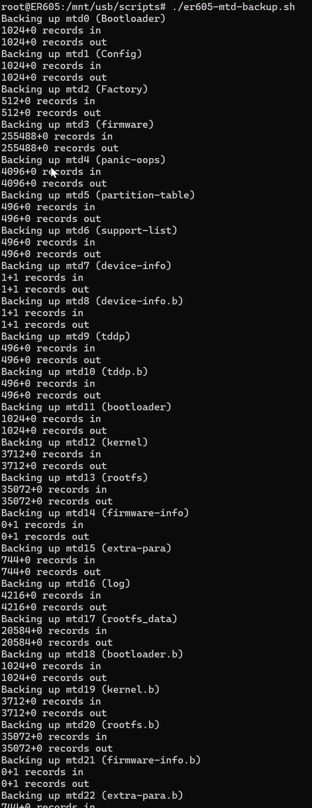
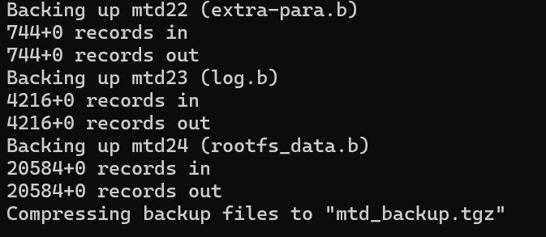

# Flashing OpenWrt on TP-Link ER605 Omada V2)

**Disclaimer**:  
⚠️ Flashing third-party firmware like OpenWrt may **void your warranty** and carries a risk of bricking your device. Proceed at your own risk. Ensure you have a recovery plan (e.g., serial access) before starting.  
⚠️ This was tested on the out of the box firmware version v2.1.2. TP-Link firmware was not udpated prior to flashing Open-Wrt
⚠️ Recommend having a DHCP

---

This guide describes a method to flash OpenWrt on a TP-Link ER605 (v2) using an initramfs image and a flashing script. For a more in-depth explanation and troubleshooting, please refer to the [OpenWrt Wiki for TP-Link ER605 v2](https://openwrt.org/toh/tp-link/er605_v2) :contentReference[oaicite:0]{index=0} and the [GitHub repository by chill1Penguin](https://github.com/chill1Penguin/er605v2_openwrt_install) :contentReference[oaicite:1]{index=1}.

## Prerequisites

- **Device:** TP-Link ER605 (v2)
- **OEM Firmware:** Must have SSH (or Remote Assistance) enabled via the web GUI.
- **Tools:** SSH client (e.g., Windows terminal or PuTTY), and (optionally) TFTP for recovery.
- **Files to Download:**
  - **Initramfs Image:** [openwrt-initramfs-compact.bin](https://downloads.openwrt.org/releases/23.05.5/targets/ramips/mt7621/openwrt-23.05.5-ramips-mt7621-tplink_er605-v2-initramfs-kernel.bin)
  - **Sysupgrade image:** [openwrt-23.05.5-ramips-mt7621-tplink_er605-v2-squashfs-sysupgrade.bin](https://downloads.openwrt.org/releases/23.05.5/targets/ramips/mt7621/openwrt-23.05.5-ramips-mt7621-tplink_er605-v2-squashfs-sysupgrade.bin)
  - **Flashing Script:** [er605v2_write_initramfs.sh](./er605v2_write_initramfs.sh)
  - **For Latest/Snapshot/Custom Images** visit: [OpenWrt Firmware Selector for ER605 V2](https://firmware-selector.openwrt.org/?&target=ramips%2Fmt7621&id=tplink_er605-v2)
- **USB Stick (for offline installation):** Any USB Stick formatted with NTFS filesystem.

## Flashing Steps

1. **Enable SSH Access:**

   - Log into the router’s web GUI.
   - Set Username and Password for Stock Web Gui
   - Use simple passwords for Web Gui login to make it easy (These will not be used after flashing anyway)
   - I will use `admin` as username and `killer` as password through out this guide where necessary.
   - Navigate to **System Tools > Diagnostics > Remote Assistance** and enable SSH.

2. **Generate Debug Password:**

   - Visit this page [ER605 v2 Root Password Generator](https://chill1penguin.github.io/er605v2_openwrt_install/er605rootpw.html) :contentReference[oaicite:3]{index=3} for details. to generate the required debug mode (or root) password.
   - **Note:** for v2.1.2 or higher, you will not need the root password
   - **Instructions:**
     - MAC Address will be on the router's label (backside).
     - Username shoud be your WEB GUI Login Username **NOT** `root` but `admin`
     - Note down CLI Debug password for the version of Stock Firmware currently on the ER605

3. **SSH into the Router:**

   - Open your SSH client and connect to the router (default IP: `192.168.0.1`) check the label on the router to confirm the default IP.
   - Use the appropriate credentials: - **Firmware v2.1.1 and above:** Login using your web GUI credentials, then run the `enable` and `debug` commands as prompted.
   - 
   - 

4. **(Important) Backup MTD Partitions:**

   - It is highly recommended to back up your current firmware. See [Creating a Full MTD Backup](https://openwrt.org/docs/guide-user/installation/generic.backup) :contentReference[oaicite:3]{index=3} for details.

5. **Online Install - Download Flash Files:**

   - In your SSH session, change to the `/tmp` directory:
     ```bash
     cd /tmp
     ```
   - Download the flashing script and the initramfs image:
     ```bash
     curl -o er605v2_write_initramfs.sh https://raw.githubusercontent.com/chill1Penguin/er605v2_openwrt_install/main/er605v2_write_initramfs.sh
     curl -o openwrt-initramfs-compact.bin https://raw.githubusercontent.com/chill1Penguin/er605v2_openwrt_install/main/openwrt-initramfs-compact.bin
     chmod +x er605v2_write_initramfs.sh
     ```

6. **Verify the Firmware Image:**

   - Check the MD5 checksum:
     ```bash
     md5sum openwrt-initramfs-compact.bin
     ```
   - Compare the output with the checksum provided in the repository’s `md5sums` file.

7. **Flash the Initramfs Image:**

   - Run the flashing script:
     ```bash
     ./er605v2_write_initramfs.sh openwrt-initramfs-compact.bin
     ```
   - Wait until the script completes its process.

8. **Reboot the Router:**

   - Reboot your device:
     ```bash
     reboot
     ```

9. **Complete the Installation:**
   - After the router reboots, open a web browser and navigate to its IP (e.g., `http://192.168.1.1/`).
   - Follow the on-screen instructions to finish setting up OpenWrt.
   - For permanent installation, perform a sysupgrade using the appropriate sysupgrade image (for example, [OpenWrt 23.05.5 sysupgrade image for TP-Link ER605 v2](https://downloads.openwrt.org/releases/23.05.5/targets/ramips/mt7621/openwrt-23.05.5-ramips-mt7621-tplink_er605-v2-squashfs-sysupgrade.bin)).

## Notes

- **Risk Notice:** This procedure may void your warranty and could brick your router if not done correctly.
- **Backup:** Always perform a full backup of your device before proceeding.
- **Documentation:** For more detailed instructions, troubleshooting, and community support, see:
  - [OpenWrt Wiki: TP-Link ER605 v2](https://openwrt.org/toh/tp-link/er605_v2) :contentReference[oaicite:4]{index=4}
  - [GitHub: ER605 OpenWrt Installer by chill1Penguin](https://github.com/chill1Penguin/er605v2_openwrt_install) :contentReference[oaicite:5]{index=5}

---

_This guide is provided as-is. Use at your own risk._
